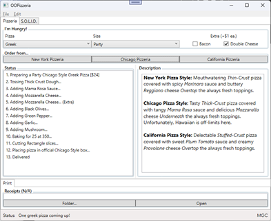

# OOPizzeria
A pizzeria application focused on object oriented programming.    
  *Start up project* => **WPFPizzeria04**

## Technologies
WPF/MVVM  
OOP  
Factory/Abstract pattern

## Description
This solution contains two decoupled project.
+ OOPizzeriaLib04, the pizza library.
+ WPFOOPizzeria04, an interface to the library above.

This project is licensed under the Michel Girard Consulting Inc. License - see the LICENSE.md file for details.
[License](LICENSE.md)
