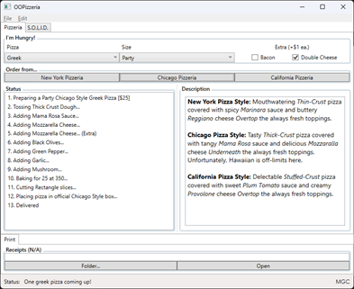

# OOPizzeria
A pizzeria application focused on object oriented programming.

## Technologies
WPF/MVVM
OOP Factory/Abstract pattern

## Description
This solution contains two decoupled project.
+ OOPizzeriaLib01, the pizza library.
+ WPFOOPizzeria01, an interface to the library above.

This project is licensed under the Michel Girard Consulting Inc. License - see the LICENSE.md file for details.
[License](LICENSE.md)